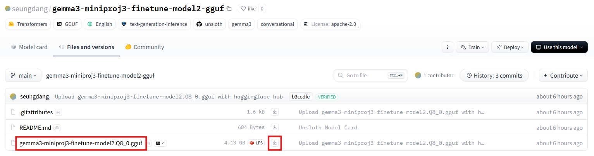

# 요리왕 좌룡
## 🍳 재료 기반 요리 레시피 추천 챗봇 서비스

<br>

## 1. 서비스 개요

이 서비스는 사용자가 가지고 있는 **재료**, **조리도구**, **희망 조리시간** 등의 조건을 입력하면, 이를 기반으로 실제 조리 가능한 레시피를 추천해주는 **AI 기반 맞춤형 요리 추천 챗봇**이다.

기존의 요리 이름 기반 검색 방식에서 벗어나, LLM과 RAG 기술을 활용하여 **재료 중심의 요리 추천**이라는 새로운 접근 방식을 제시한다.

<br>

## 2. 서비스 기획 배경

- 🔎 **기존 레시피 검색의 한계**  
  → 사용자가 요리 이름이나 키워드를 모르면 검색이 어려움

- 🧊 **현실적인 사용자 불편**  
  → 냉장고에 있는 재료로 무엇을 할 수 있을지 몰라 포기하는 상황 다수

- ⏱️ **사용자 제약 조건 고려 부족**  
  → 자취생, 바쁜 직장인 등 도구나 시간 제약 반영 어려움

📌 해당 챗봇은 유튜브 요리 영상의 자막 데이터를 기반으로 LLM을 파인튜닝하거나 RAG 방식으로 검색하여, 현실적으로 조리 가능한 레시피를 추천하는 **실행 가능한 AI 요리 서비스**를 지향한다.

<br>

## 3. 사용자 경험 흐름 (UX 시나리오)

### ✅ 사용자의 입력 단계
- **보유 재료**: 예) 감자, 양파, 계란 *(텍스트 입력)*
- **사용 가능한 조리도구**: 예) 후라이팬, 전자레인지 *(Select Box)*
- **희망 조리 시간**: 예) 10분 이하, 30분 이하 *(Select Box)*

➡️ ‘**전송**’ 버튼 클릭

### 🤖 챗봇의 응답 예시
```
🥔🍳 감자달걀전 요리를 추천드립니다.

부침가루가 없는 경우, 계란과 감자 전분으로 대체 가능합니다.

[요리 순서]
1. 감자를 강판에 갈아 수분 제거
2. 계란을 풀어 감자와 반죽
3. 팬에 기름을 두르고 약불에서 부치기
4. 앞뒤로 노릇하게 익히기
5. 간장 + 식초 찍어 먹기

맛있게 드세요~ 😋
```
➡️ 챗봇은 단순한 텍스트 레시피를 넘어서, **대체 가능한 재료 안내**, **조리 순서 제공**, **사용자 조건에 맞춘 최적화된 제안**을 제공한다.

<br>

## 4. 기술 구성 요소

### 🧠 LLM 모델
- **파인튜닝 대상**: gemma3-4b Model

### 🔍 검색 기반 QA (RAG 방식)
- 사용자 입력값(재료, 조리도구, 시간)을 기반으로 관련 자막을 검색
- 검색 결과를 LLM에 제공하여 맥락 이해 + 응답 생성

#### 🔹 Embedding Model
- OpenAI의 소형 embedding 모델 (텍스트 벡터화 용도)

#### 🔹 Vector DB
- FAISS 활용, 유사한 요리 레시피 클러스터링 및 검색

<br>

## 5. 데이터 소스

### Fine-Tuning - 유튜브 자막 기반
- [딸을 위한 레시피 유튜브](https://www.youtube.com/@%EB%94%B8%EC%9D%84%EC%9C%84%ED%95%9C%EB%A0%88%EC%8B%9C%ED%94%BC/playlists)
- [백종원의 요리비책](https://www.youtube.com/playlist?list=PLoABXt5mipg4vxLw0NsRQLDDVBpOkshzF)
- [백종원의 쿠킹로그](https://www.youtube.com/watch?v=5-a5CPASYBc&list=PLoABXt5mipg6mIdGKBuJlv5tmQFAQ3OYr)
- [한가지 재료로 N가지 요리 만들기
](https://www.youtube.com/playlist?list=PL7T0UWXKNl7TXa5t6I2qJ6vWtJhTSpRyt)

📌 해당 채널들은 자막 품질이 비교적 우수하거나 실제 요리 흐름이 잘 기록되어 있다.

### RAG
- [만개의 레시피](https://www.10000recipe.com/?srsltid=AfmBOoq_msLnwDaByNGMj6nSyX_i7IqxU3u43aEKLXwu5yqbxqN9foHs)

📌 해당 사이트에서 필요한 정보를 `BeautifulSoup`을 통해 추출하여 사용하였다.


<br>

## 5-1. 데이터셋 생성

### 1. 데이터 수집

`yt-dlp` 라이브러리를 사용하여 유튜브 영상의 자막 데이터를 추출한다.

### 2. 전처리 과정

- 자막 내 불필요한 요소 제거
- 요리와 직접적인 관련이 없는 단어 또는 문장 제거
- 음성 인식 오류로 잘못 표기된 단어 수정
- 특수문자 및 이모티콘 제거

### 3. 질문-답변 데이터셋 생성

전처리된 자막 데이터를 기반으로 `gpt-4o-mini` 모델을 사용하여 요리 과정을 중심으로 한 질문-답변 데이터셋을 생성한다.


<br>

## 6. 사용자 케이스별 활용 예시

| 🎯 케이스 유형       | 설명 |
|------------------|------|
| 🧊 냉장고 재료 기반   | 요리 이름 없이도 보유 재료만으로 추천 가능 |
| 🍳 조리도구 기반     | 보유한 도구(전자레인지, 후라이팬 등)를 기반으로 한 요리 추천 |
| ⏱️ 시간 부족         | 조리 시간 기반 필터링으로 바쁜 직장인도 활용 가능 |
| 🧑‍🍳 요리 초보         | 상세한 조리 순서 제공으로 따라 하기 쉬움 |

<br>

## 7. 확장 가능성 및 고도화 아이디어

| 기능               | 설명 |
|------------------|------|
| 🔁 연속 대화 지원     | “다른 요리는?”, “이 재료 빼고는?” 등의 후속 질의 처리 |
| 📷 재료 이미지 인식   | 사진 업로드 시 재료 자동 추출 (OCR + 모델 결합) |
| 🛒 장보기 연동        | 부족한 재료를 쇼핑몰 장바구니로 자동 연결 |
| 💾 사용자 맞춤 저장   | 자주 쓰는 조리 조건, 재료, 도구 정보 자동 저장 후 추천 강화 |

<br>

## 8. 요약 및 기대 효과

이 챗봇은 **현실적인 조리 제약을 고려한 개인 맞춤형 요리 추천**이라는 명확한 사용자 가치를 제공한다.

- **입력은 간단하게**, 출력은 **풍부하고 실행 가능하게**
- **재료 낭비를 줄이고**, **요리 진입장벽을 낮추는** 실용적인 AI 서비스

<br>

## 9. 응답 생성 및 서비스 동작 프로세스


### 🔍 단계별 설명

#### ① 사용자 입력

사용자가 조리 시간, 조리 도구 등의 정보를 포함하여 질문을 입력한다.

#### ② 요리 관련 여부 판단

- 입력된 질문이 요리와 관련된 경우 ➡️ **레시피 추천 LLM**이 답변 생성
- 입력된 질문이 요리와 관련이 없는 경우 ➡️ **일반 LLM**이 답변 생성

#### ③ 레시피 추천 LLM 답변 적절성 평가

- 답변이 적절한 경우 ➡️ **레시피 추천 LLM** 답변 출력
- 답변이 적절하지 않은 경우 ➡️ **RAG** 실행

#### ④ RAG

- **멀티 쿼리**를 생성하여 문서 검색 성능 향상
- 관련 문서가 있을 경우 ➡️ **내부문서 RAG** 기반 답변 생성
- 관련 문서가 없을 경우 ➡️ **외부문서 RAG** 기반(Tavily) 답변 생성

#### ⑤ 최종 출력

- 최종 생성된 답변 결과를 사용자에게 출력

📌 이 프로세스를 통해 단순한 레시피 검색을 넘어서, 사용자의 상황에 최적화된 **실행 가능한 요리 제안**을 자동 생성할 수 있다.

<br>

## 10. 설치 및 실행 방법

이 챗봇 서비스를 로컬에서 실행하려면 아래의 단계를 따라야 한다.

### 📁 1. 프로젝트 클론

```bash
git clone https://github.com/your-username/recipe-chatbot.git
```

### 🧪 2. 가상환경 생성 및 라이브러리 설치

```bash
uv venv .venv -p [파이썬 버전 ex) 3.12]
.\.venv\Scripts\activate
uv pip install -r requirements.txt
```

### 🧠 3. Ollama 모델 설치

Hugging Face에 등록된 모델을 사용하기 위해 `.gguf` 파일을 다운로드하여 Ollama에 설치한다.<br/>
자세한 설치 방법은 `10-1`을 참고한다.

### 🔐 4. 환경 변수 설정 (.env 파일 생성)

`etl/fine-tuning ` 안의 `파인튜닝 된 모델들 2개 GPT로 비교.ipynb` 파일을 전체 실행하기 위해서는 아래의 작업을 진행해야 한다.
`.env` 파일을 프로젝트 루트 디렉터리에 생성하고, 다음 내용을 추가해야 한다:

```env
OPENAI_API_KEY=[your_openai_api_key_here]
[허깅페이스 허브 토큰 이름] = [your_hf_token_api_key_here]
```

### 🚀 5. 실행
Streamlit을 사용하는 경우:

```bash
streamlit run app.py
```

<br>

## 10-1. Ollama 모델 설치

### 📥 1. `.gguf` 파일 다운로드

[Hugging Face 모델](https://huggingface.co/seungdang/gemma3-miniproj3-finetune-model2-gguf) 페이지에서 `.gguf` 확장자를 가진 파일을 다운로드한다.



### 🗂️ 2. Modelfile을 통한 모델 설치

#### 📁 2-1. 파일 위치 지정

Hugging Face에서 다운로드한 `.gguf` 파일과 `Modelfile`을 동일한 디렉토리에 위치시킨다.


#### 📝 2-2. Modelfile 수정

Modelfile 내 `FROM` 구문을 다운로드한 `.gguf` 파일 이름으로 수정한다.

```dockerfile
FROM gemma3-miniproj3-finetune-model2.Q8_0.gguf

TEMPLATE """{{- if .System }}
<s>{{ .System }}</s>
{{- end }}
<s>Human:
{{ .Prompt }}</s>
<s>Assistant:
"""

SYSTEM """A chat between a curious user and an artificial intelligence assistant. The assistant gives helpful, detailed, and polite answers to the user's questions."""

PARAMETER temperature 0
PARAMETER num_predict 3000
PARAMETER num_ctx 4096
PARAMETER stop <s>
PARAMETER stop </s>
```

#### ⚙️ 2-3. Powershell을 통한 모델 추가

다음 명령어를 통해 Local 환경에 모델을 설치한다.

```shell
cd [.gguf 및 Modelfile 위치]
ollama create gemma3-recipe -f Modelfile
```

설치가 완료되면 `ollama list` 명령어로 모델이 추가된 것을 확인할 수 있다.


<br>

## 11. 이슈 및 해결방법

### 1. Fine-Tuning + RAG

- **문제** : Fine-Tuning된 모델과 RAG를 함께 사용하면 더 정확한 답변을 생성할 수 있을 거라고 기대했지만, 실제로는 두 방식의 역할이 섞이면서 모델이 혼란스러워하고, 오히려 비논리적인 답변이 생성되는 문제가 발생했다.

- **해결방법** : Fine-Tuning된 모델과 RAG를 분기로 나누어 응답 적절성 여부에 따라 각 방식이 독립적으로 실행되도록 처리하였다.

### 2. OpenAI API 제한

- **문제** : 유튜브 자막에 대한 질문-답변 데이터셋을 생성하는 과정에서 OpenAI API 사용량 제한에 도달하여, 데이터셋 생성이 제한되는 문제가 발생되었다.

- **해결방법** : csv 데이터의 개수를 100개씩으로 나누어 저장했고, 하나의 CSV 파일을 불러와서 데이터셋으로 만든 이후에는 API 요청을 일정 시간동안 딜레이 시켜 데이터셋을 생성했다. 딜레이를 사용해 요청을 보냄으로써 안정정적으로 데이터셋을 생성할 수 있었다.

### 3. 최종 답변 형식 프롬프트

- **문제** : message_history의 첫 메시지는 system_message로써 해당 LLM이 답변해줬으면 하는 형식과 내용을 예시와 함께 말을 해줬으나 LLM이 잘 이해하지 못하는 문제가 발생되었다.

- **해결방법** : 테디노트, 다른 개발자들의 프롬프트 양식을 참고하여 우리의 서비스에 맞게 수정했고, 이후 우리가 원하는 형식과 유사하게 답변하는 것을 확인할 수 있었다.

<br>

## 12. 회고

### 최수헌

다들 고생 많으셨습니다. 늦은 시간까지 같이 더 나은 프로젝트를 위해 노력했기 때문에 잘 마무리 할 수 있었습니다. 우리팀 짱짱

### 문승기

파인튜닝 쪽을 맡아서 진행하다 보니, 실제로 이해했다고 생각했던 부분들 중 부족한 부분이 많았다는 생각이 들었습니다. 최선을 다해서 진행했고, 뿌듯했습니다.

### 이유호

프로젝트에 참여하면서 팀원분들이 제가 부족한 부분들을 알려줘서 LLM에 대해 조금 더 이해할 수 있는 유익한 시간이었습니다.

### 전서빈

비록 참여를 제대로 하지 못하였지만 어떻게 돌아가는지 팀원분들과 팀장님이 설명을 잘해주셔서 배우는 시간이 되었던 것 같습니다. 고생많으셨습니다.

### 좌민서

이번 프로젝트를 통해서 LLM에 대해서 더 잘 이해할 수 있었고, 팀원분들이 너무 잘해주셔서 많이 배울 수 있었던 좋은 경험이 되었습니다.

### 홍승표

자고 일어났는데 전부 다 만들어져있었습니다. 저는 팀원들이 차려놓은 밥상에 김가루만 뿌렸습니다. 고생하셨습니다. 우리 팀 최고입니다. 다음 단위 프로젝트때는 만나지마요.
